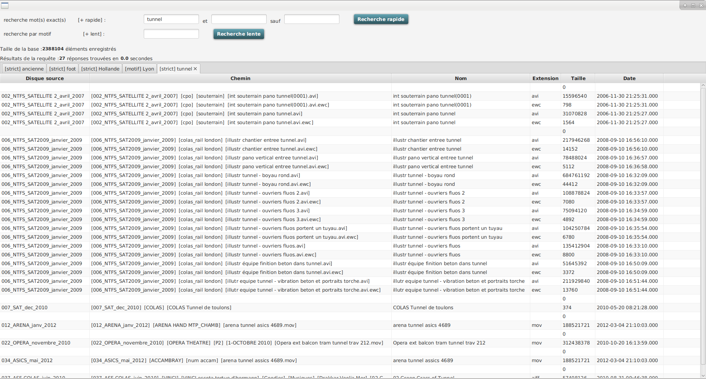
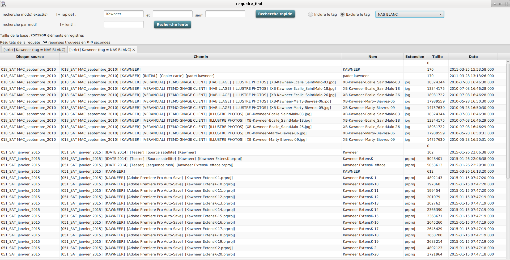
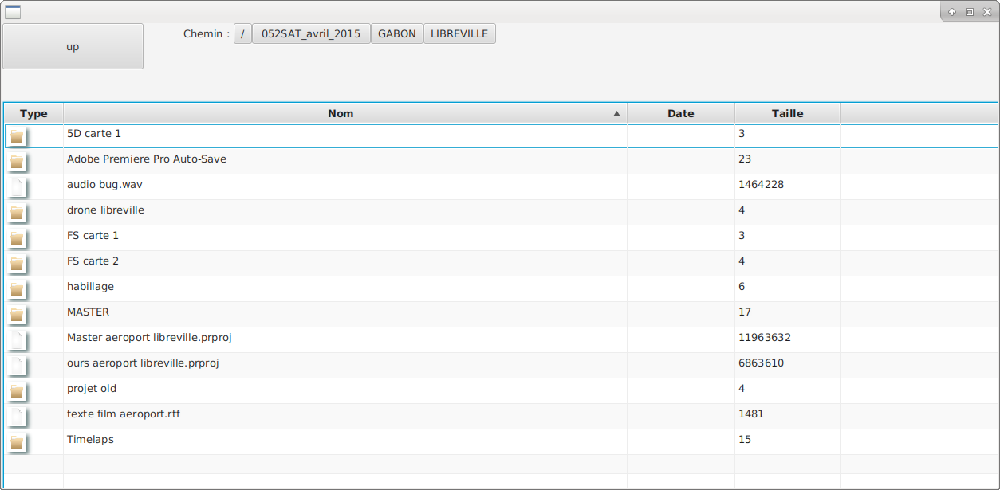
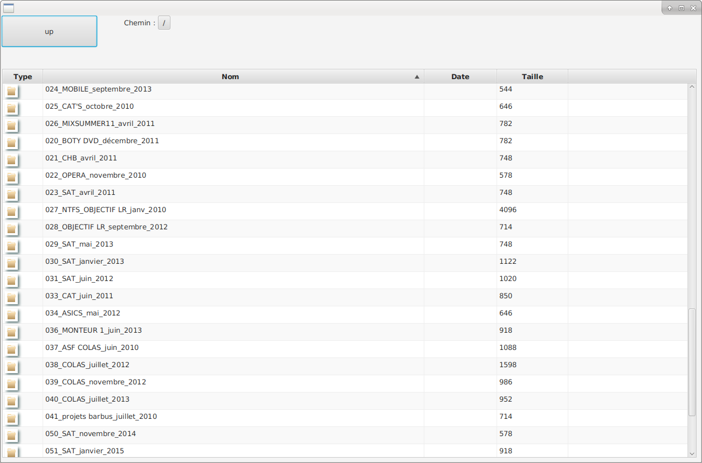

# LequelFX
*LequelFX est une série d'outil pour garder en base de données les arborescences historicisées des disques déconnectés*

####LequelFX est une interface de recherche dans les disques durs archivés :

- recherche par nom ou par motif sur les noms de fichiers, même sur les disques déconnectés

- navigation virtuelle dans la structure des fichiers des disques, même déconnectés

####recherche et onglets

####recherche et onglets et tags

####navigation dans les fichiers virtuels

####navigation dans les fichiers virtuels (racine de l'ensemble des disques)

